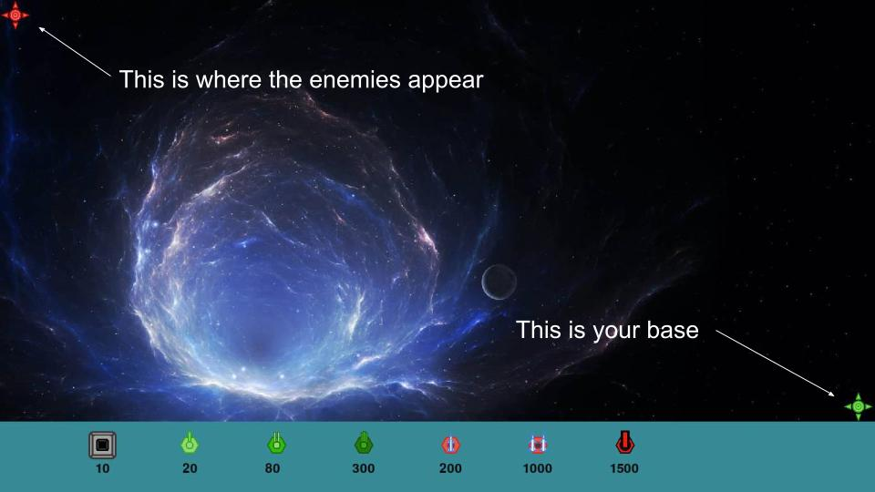

# Tower defense
This is a 2D tower defense game made by pygame. It requires a python IDE to run and pre-installed pygame.

 
The target is to avoid the enemies to enter your base

 

 

## Set Up part
Before you start each wave, there will be a grid to assist you.
 

 
Press key 1 on your keyboard, you can choose the "Block". The block can block the enemies' path, and allow you to put your towers.

If you click on a block without a tower on it, you will remove that block and have your money back.

 

 
Note! You can not completly block the path! The program will not respond to your command.

 

